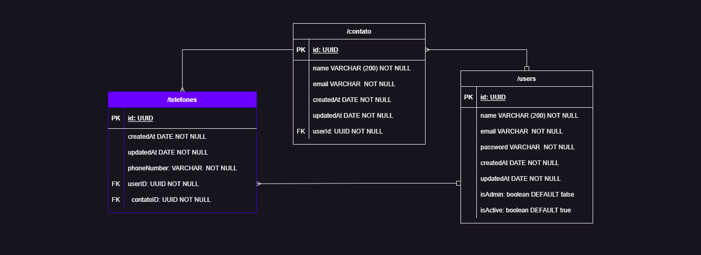

# Projeto tech full stack - Agenda de Contatos



## Tecnologias

<div style='display:flex; gap: 5px;'><br>
  
 

 


  

   
</div></br>


## Configurações e instalação de dependências do Projeto

Para inciar este projeto, você deve instalar  as dependências. Portanto utilize o comando abaixo para instalar tais dependências:

````
yarn install
````


**Atenção:** é necessário utilizar o <strong>`yarn` </strong>pois esse projeto foi iniciado com esse gerenciador de pacotes.

Para verificar se já possui o gerenciador yarn instalado utilize o seguinte comando:

````
yarn --version
````

Caso não possua o yarn instalado, utilize o comando abaixo para instalar globalmente na sua máquina:

````
npm install --global yarn
````
<br>


O Docker está configurado, basta preencher as variáveis de ambiente no .env

Basta buildar e subir nossos containers usando o comando padrão:
````
docker-compose up --build /
````

ou
````
docker compose up --build
````
 

***ATENÇÃO:*** a porta utilizada para rodar o docker é a `5431`.
Caso tenha algum problema com essa porta, basta alterá-la no <strong>docker-compose.yml.</strong>

<br>
 

# 

### Agora que já sabe como iniciar o seu projeto e rodar os testes, é hora de colocar a mão no código!